<div align="center">



### *A living ML lab — built from scratch, one algorithm at a time.*

[](https://python.org)
[](https://jupyter.org)
[](https://scikit-learn.org)
[](https://xgboost.readthedocs.io)
[](https://tensorflow.org)

</div>

---

## ⚡ What is this?

This repo is my hands-on ML laboratory — every algorithm explored deeply, not just imported and called. The philosophy here is simple: **understand it, implement it, visualize it, apply it**.

From hand-rolling gradient descent with NumPy to building production-style ensemble pipelines with XGBoost and CatBoost — it's all here, organized by concept and built to be re-read.

> 40+ topics · 100+ notebooks · From-scratch implementations · Real datasets · Animated visualizations

---

## 🗂️ Repository Map

### 🧮 Foundations — Math & Core Algorithms

| Folder | What's Inside |
|--------|--------------|
| [`gradient-descent/`](./gradient-descent) | Batch GD · Stochastic GD · Mini-Batch GD · GD for Logistic Regression — all from scratch on real datasets |
| [`linear-regression/`](./linear-regression) | OLS, cost functions, weight updates — implemented manually |
| [`polynomial-regression/`](./polynomial-regression) | Feature expansion and overfitting intuition |
| [`logistic-regression/`](./logistic-regression) | Binary classification, sigmoid, decision boundaries |
| [`perceptron/`](./perceptron) | The OG neural net, hand-coded — `PerceptronFromScratch.ipynb` |
| [`regularization-techniques/`](./regularization-techniques) | L1, L2 regularization and the bias-variance tradeoff |

---

### 🌲 Supervised Learning — Classical Models

| Folder | What's Inside |
|--------|--------------|
| [`decision-tree/`](./decision-tree) | Gini, entropy, pruning — full decision tree intuition |
| [`knn/`](./knn) | k-Nearest Neighbors, distance metrics |
| [`naive-bayes/`](./naive-bayes) | Bayes theorem to probabilistic classifier |
| [`svm/`](./svm) | Support Vector Machines, kernel tricks, high-dimensional boundaries |

---

### 🚀 Ensemble Methods — The Heavy Hitters

| Folder | What's Inside |
|--------|--------------|
| [`random-forest/`](./random-forest) | Bagging trees, feature importance, OOB error |
| [`gradient-boosting/`](./gradient-boosting) | Boosting from first principles |
| [`xgbclassifier/`](./xgbclassifier) | XGBoost deep-dives — classification, regression, hyperparameter tuning |
| [`Adaboost/`](./Adaboost) | Adaptive boosting, weak learner composition |
| [`bagging-ensemble/`](./bagging-ensemble) | Bagging theory and variance reduction |
| [`voting-ensemble/`](./voting-ensemble) | Hard and soft voting strategies |

---

### 🔍 Unsupervised Learning

| Folder | What's Inside |
|--------|--------------|
| [`unsupervised-learning/`](./unsupervised-learning) | KMeans on Iris · DBSCAN on blobs · Agglomerative clustering · Market Basket Analysis |
| [`pca/`](./pca) | Dimensionality reduction, explained variance, `pca_rotation.gif` |

---

### 🧹 Data Engineering Pipeline

| Folder | What's Inside |
|--------|--------------|
| [`data-cleaning-problems/`](./data-cleaning-problems) | Missing values (CCA, imputation) · Outliers (Z-Score, IQR) · Duplicates |
| [`preprocessing-concepts/`](./preprocessing-concepts) | Encoding, scaling, skew correction, `ColumnTransformer`, `Pipeline` |
| [`data-analysis-problems/`](./data-analysis-problems) | EDA walkthroughs, statistical analysis |
| [`data-plotting-practice/`](./data-plotting-practice) | Seaborn & Matplotlib — uni/bi/multivariate analysis |
| [`y-data-profiling/`](./y-data-profiling) | Automated EDA reports with ydata-profiling |

---

### 📊 Applied Problems & Competitions

| Folder | What's Inside |
|--------|--------------|
| [`classification-problems/`](./classification-problems) | End-to-end classification case studies |
| [`titanic-competition/`](./titanic-competition) | Kaggle Titanic — EDA + univariate analysis + submission pipeline |
| [`customer-churn-telco/`](./customer-churn-telco) | Telco churn prediction, full ML pipeline |
| [`time-series-problems/`](./time-series-problems) | ARIMA · Time Series decomposition |

---

### 🌐 Data Acquisition

| Folder | What's Inside |
|--------|--------------|
| [`web-scraping-and-fetching/`](./web-scraping-and-fetching) | BeautifulSoup scraping · YouTube video scraping · RapidAPI fetching |

---

### 🎬 Visualizations

The [`visualizations/`](./visualizations) folder contains custom-built animated and interactive visuals:

- 🎞️ `perceptron_training.gif` — Perceptron decision boundary updating live
- 🎞️ `pca_rotation.gif` — PCA dimensionality reduction in motion
- 🌐 `logistic_regression_deep_dive.html` — Interactive logistic regression explorer
- 🌐 `least-squares-3d.html` — 3D least squares loss surface

---

## 🛠️ Tech Stack

```
Core          →  NumPy · Pandas · SciPy · Polars
ML            →  Scikit-Learn · XGBoost · LightGBM · CatBoost · MLflow
Deep Learning →  TensorFlow · Keras
Visualization →  Matplotlib · Seaborn · Plotly · Altair · Missingno · Wordcloud
Data Scraping →  BeautifulSoup4 · Requests · PyTube · yt-dlp
Profiling     →  ydata-profiling · dtreeviz · mlxtend
Deployment    →  Streamlit · Flask · FastAPI
```

---

## 🚀 Getting Started

```bash
# Clone the repo
git clone https://github.com/AyushDevadiga1/ML.git
cd ML

# Set up virtual environment
python -m venv .venv
.venv\Scripts\activate        # Windows
# source .venv/bin/activate   # macOS/Linux

# Install dependencies
pip install -r requirements.txt

# Launch Jupyter
jupyter notebook
```

> Each folder is self-contained. Open any `.ipynb` and run top to bottom.

---

## 📁 Full Folder Index

<details>
<summary>Click to expand all folders</summary>

```
ML/
├── assets/                     Banner SVG and visual assets
├── Adaboost/                   Adaptive boosting
├── bagging-ensemble/           Variance reduction via bagging
├── books_and_research_papers/  Reference material
├── classification-problems/    Applied classification case studies
├── customer-churn-telco/       Telco churn end-to-end project
├── data-analysis-problems/     EDA and statistical analysis
├── data-cleaning-problems/     Missing values, outliers, duplicates
├── data-plotting-practice/     Seaborn, Matplotlib deep dives
├── datasets/                   Raw datasets used across notebooks
├── decision-tree/              Decision tree from intuition to code
├── gradient-boosting/          Boosting mechanics and implementation
├── gradient-descent/           All GD variants from scratch
├── knn/                        K-Nearest Neighbors
├── linear-regression/          OLS and manual regression
├── logistic-regression/        Binary classification, sigmoid
├── misc/ & miscellaneous/      Experiments and scratch work
├── models/                     Saved model files (.pkl etc.)
├── naive-bayes/                Probabilistic classification
├── output/                     Generated outputs and results
├── pca/                        Principal Component Analysis
├── perceptron/                 Perceptron from scratch
├── polynomial-regression/      Feature expansion
├── preprocessing-concepts/     Full sklearn Pipeline workflows
├── random-forest/              Ensemble bagging trees
├── references/                 Papers, links, notes
├── regularization-techniques/  L1/L2 regularization
├── svm/                        Support Vector Machines
├── time-series-problems/       ARIMA and time series analysis
├── titanic-competition/        Kaggle Titanic pipeline
├── unsupervised-learning/      KMeans, DBSCAN, Agglomerative, MBA
├── visualizations/             GIFs, interactive HTML visuals
├── voting-ensemble/            Hard and soft voting classifiers
├── web-scraping-and-fetching/  BeautifulSoup + API scraping
├── xgbclassifier/              XGBoost deep-dives
└── y-data-profiling/           Automated EDA reports
```

</details>

---

<div align="center">

**Built with curiosity. Documented with intent.**

[](https://github.com/AyushDevadiga1)
[](https://www.kaggle.com/ayushdevadiga)
[](https://www.linkedin.com/in/ayush-devadiga-aiml)

</div>
