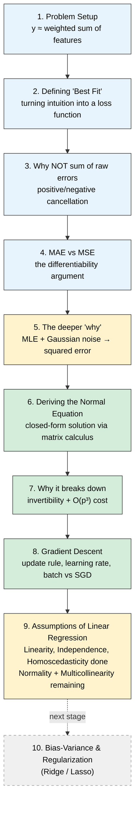

# Linear Regression — Deep Dive Notes

> **Where this fits:** End-to-end mastery track on Linear Regression — "the mother of all ML algorithms." Everything here was *derived*, not memorized, using a Socratic back-and-forth. Treat this as the reference doc to revisit, not the primary learning method — the understanding happened in the derivation, this is just the crystallized trail.

---

## The Roadmap (full picture)

**Covered in this document:** Stages 1–8 fully (green), Stage 9 partially — 3 of 5 assumptions done (yellow = in progress).
**Not yet covered:** Normality of residuals, No multicollinearity (rest of Stage 9), Bias-Variance & Regularization (dashed box — coming next).

---

## Stage 1 — What Problem Is Linear Regression Solving?

You have examples. Each has **input features** $x_1, x_2, \dots$ and a **target** $y$. The core belief (an *assumption*, not a fact) is that the target is approximately a **weighted sum of the inputs**, plus noise:

$$y \approx w_1 x_1 + w_2 x_2 + \dots + w_n x_n + b$$

Linear Regression is the algorithm that finds the best $w_1, \dots, w_n, b$ given data. Two questions immediately follow:

1. Why would reality behave like a weighted sum at all?
2. What does "best" even mean — best by what criterion?

Question 2 is what the rest of this document answers.

---

## Stage 2 — From Intuition to a Loss Function

**Starting intuition:** the best line is the one "closest to all points at the same time." This is a *goal*, not yet *math* — a line can hug three points and be far from two others, so we need a single number that scores "how good is this line, overall."

For a candidate line $\hat{y} = wx + b$, each point has an error:

$$e_i = y_i - \hat{y}_i = y_i - (wx_i + b)$$

### First attempt: sum of raw errors — and why it fails

Try summing the $e_i$ directly. Counter-example: two points at $x=1, x=2$, both with true $y=5$. A bad, slanted line predicts $\hat y = 7$ at $x=1$ and $\hat y = 3$ at $x=2$.

$$e_1 = 5-7=-2, \qquad e_2 = 5-3=+2, \qquad e_1+e_2 = 0$$

The **perfect** line (flat at $y=5$) also gives a sum of $0$. Two wildly different lines score identically — **positive and negative errors cancel**, like two people pushing a box from opposite sides with zero net force despite both straining hard. Sum of raw errors is a broken scorecard.

### Fixing the cancellation: two candidates

To stop errors from cancelling, apply an operation to each $e_i$ *before* summing that ignores sign:

- **Mean Absolute Error (MAE):** sum of $|e_i|$
- **Mean Squared Error (MSE):** sum of $e_i^2$

### Why MSE, not MAE — Reason 1: Differentiability

Both closed-form (Normal Equation) and iterative (Gradient Descent) solutions rely on **derivatives** to find the minimum — the bottom of a valley has zero slope.

**Derivative of $|e|$:**

$$|e| = \begin{cases} e & e \geq 0 \\ -e & e < 0 \end{cases} \quad\Rightarrow\quad \frac{d}{de}|e| = \begin{cases} +1 & e>0 \\ -1 & e<0 \end{cases}$$

At $e=0$: approaching from the left gives slope $-1$; from the right, slope $+1$. These disagree, so **the derivative does not exist at $e=0$** — a genuine kink (like the corner of a tent). Geometrically: no single tangent line can be drawn at a sharp corner; infinitely many lines from slope $-1$ to $+1$ would all touch only at that point.

**The problem this creates:** $e=0$ is *exactly* the point we're trying to converge toward (perfect prediction). Optimization tools that rely on derivatives lose their guidance signal exactly where it matters most — like a compass that spins randomly the closer you get to your destination.

**Derivative of $e^2$:** $\dfrac{d}{de}e^2 = 2e$ — defined *everywhere*, including at $e=0$ (where it's simply $0$), and it shrinks smoothly toward zero as $e\to 0$. No kink, ever.

> **Pillar 1:** Squared error is differentiable everywhere, including at the minimum — making it usable with calculus-based optimization. Absolute error is not differentiable exactly at the point we're trying to reach.

This is a *convenience* argument. Pillar 2 below is a *correctness* argument — a principled reason, not just an easy one.

---

## Stage 3 — The Deeper "Why": Maximum Likelihood Estimation (MLE)

### Setup: treating noise as random

Rewrite the model with an explicit noise term:

$$y = wx + b + \epsilon$$

Instead of treating $\epsilon$ as a fixed mystery number, treat it as a **random variable** drawn from a probability distribution.

**Reasoned intuition (derived, not asserted):**
- If positive and negative noise aren't roughly balanced, that's a sign the line is *mispositioned* — not a property of "true" noise. A correctly-fit line splits the densest region of residuals, so positive and negative errors should be **equally likely**.
- Small errors should be far more common than large ones (a well-behaved model shouldn't produce huge deviations often).

Sketching a curve with these two properties — symmetric around 0, peaked at 0, decaying at the tails — produces a **mountain / bell shape**: the **Gaussian (Normal) distribution**.

### The Gaussian PDF, decoded

$$P(\epsilon) = \frac{1}{\sigma\sqrt{2\pi}} \, e^{-\frac{\epsilon^2}{2\sigma^2}}$$

- $\epsilon$ — the noise value
- $\sigma$ — controls the spread ("width") of the mountain
- $\frac{1}{\sigma\sqrt{2\pi}}$ — normalizing constant (ensures total area under curve = 1)
- $e^{-\epsilon^2/2\sigma^2}$ — the interesting part; note $\epsilon^2$ is baked directly into the exponent

**Sanity checks:**
- At $\epsilon = 0$: exponent $= 0$, so $e^0 = 1$, giving $P(0) = \frac{1}{\sigma\sqrt{2\pi}}$ — the **maximum** of the curve. (Numerically, for $\sigma=1$: $\frac{1}{\sqrt{2\pi}} \approx 0.3989$ — note this is a **density**, not literally "probability = 1." Densities can be any positive number; only the *total area* under the curve is constrained to equal 1.)
- As $|\epsilon|$ grows large: $\epsilon^2$ grows large and positive, the minus sign makes the exponent large and **negative**, and $e^{\text{large negative}} \to 0$. So $P(\epsilon)$ shrinks monotonically toward zero as errors grow — matching the "extreme errors are rare" intuition exactly.

### From individual probabilities to Likelihood

For $n$ data points, each has error $\epsilon_i = y_i - (wx_i+b)$. Assuming each point's noise is **independent** of the others (an assumption — flagged for the later "Assumptions" stage), the joint probability of observing *all* the data is the **product** of individual Gaussian probabilities:

$$L(w,b) = \prod_{i=1}^{n} \frac{1}{\sigma\sqrt{2\pi}} e^{-\frac{\epsilon_i^2}{2\sigma^2}}$$

This is the **likelihood**. MLE's strategic idea: the best $w,b$ are whichever make the *observed data* look as probable — as unsurprising — as possible.

### Log-likelihood: turning products into sums

Products of exponentials are painful to differentiate. Take the log (strictly increasing, so the maximizer is unchanged):

$$\ell(w,b) = \log L(w,b) = \sum_{i=1}^n \log\left(\frac{1}{\sigma\sqrt{2\pi}}\right) - \sum_{i=1}^n \frac{\epsilon_i^2}{2\sigma^2}$$

(using $\log(ab) = \log a + \log b$ and $\log(e^x) = x$)

The **first term contains no $w$ or $b$** — it's constant with respect to what we're optimizing. A constant added to a function shifts its *value* but never *where* its max/min occurs (its derivative is zero), so it can be dropped entirely for the purpose of finding the best $w,b$.

$$\text{maximizing } \ell(w,b) \;\equiv\; \text{maximizing } -\sum_{i=1}^n \frac{\epsilon_i^2}{2\sigma^2}$$

$\frac{1}{2\sigma^2}$ is a positive constant multiplier — doesn't shift the location of the max either:

$$\equiv \;\text{maximizing } -\sum_{i=1}^n \epsilon_i^2 \;\equiv\; \textbf{minimizing } \sum_{i=1}^n \epsilon_i^2$$

### The punchline

$$\sum_{i=1}^n \epsilon_i^2 = \sum_{i=1}^n \left(y_i - (wx_i+b)\right)^2$$

> **Pillar 2:** Minimizing squared error is not an arbitrary or merely-convenient choice. It is the **mathematically forced consequence** of assuming the noise in your data is Gaussian (symmetric, zero-centered, small-errors-more-likely-than-large). "Minimize squared error" and "assume Gaussian noise" are the same statement viewed from two angles.

**Side note for later:** different noise assumptions yield different loss functions. Laplace-distributed noise → Mean Absolute Error via the exact same MLE machinery. No ML loss function is arbitrary — each secretly encodes a belief about the noise distribution.

---

## Stage 4 — Deriving the Normal Equation (Closed-Form Solution)

### Vectorizing the model

Generalize from one feature to $p$ features. For point $i$:

$$\hat{y}_i = w_1 x_{i1} + w_2 x_{i2} + \dots + w_p x_{ip} + b$$

Absorb $b$ into the weight vector by adding a dummy column of $1$s to the data matrix. Define:

- $\mathbf{X}$ — design matrix, shape $n \times (p+1)$ (rows = data points, columns = features + the dummy $1$s column)
- $\mathbf{w}$ — weight vector, shape $(p+1) \times 1$ (includes $b$ as its first element)
- $\mathbf{y}$ — target vector, shape $n \times 1$

Model for all points at once: $\hat{\mathbf{y}} = \mathbf{X}\mathbf{w}$

Loss (using $\sum_i v_i^2 = \mathbf{v}^T\mathbf{v}$):

$$L(\mathbf{w}) = (\mathbf{y}-\mathbf{X}\mathbf{w})^T(\mathbf{y}-\mathbf{X}\mathbf{w})$$

### Expanding and differentiating

$$L(\mathbf{w}) = \mathbf{y}^T\mathbf{y} - \mathbf{y}^T\mathbf{X}\mathbf{w} - (\mathbf{X}\mathbf{w})^T\mathbf{y} + (\mathbf{X}\mathbf{w})^T(\mathbf{X}\mathbf{w})$$

Since $(\mathbf{X}\mathbf{w})^T\mathbf{y} = \mathbf{y}^T\mathbf{X}\mathbf{w}$ (both are scalars, so each equals its own transpose), the two middle terms combine:

$$L(\mathbf{w}) = \mathbf{y}^T\mathbf{y} - 2\mathbf{y}^T\mathbf{X}\mathbf{w} + \mathbf{w}^T\mathbf{X}^T\mathbf{X}\mathbf{w}$$

Differentiate w.r.t. $\mathbf{w}$ and set to zero:

$$-2\mathbf{X}^T\mathbf{y} + 2\mathbf{X}^T\mathbf{X}\mathbf{w} = \mathbf{0}$$

$$\mathbf{X}^T\mathbf{X}\,\mathbf{w} = \mathbf{X}^T\mathbf{y}$$

If $\mathbf{X}^T\mathbf{X}$ is invertible:

$$\boxed{\mathbf{w} = (\mathbf{X}^T\mathbf{X})^{-1}\mathbf{X}^T\mathbf{y}}$$

**The Normal Equation** — the exact optimal weights, in one shot, no iteration.

### When does it break: invertibility

A matrix is invertible when (all equivalent statements about the *same* underlying fact — full rank):

- Determinant $\neq 0$
- It's square ($n\times n$)
- Columns are **linearly independent**
- $A\mathbf{x}=\mathbf{0}$ has only the trivial solution $\mathbf{x}=\mathbf{0}$

Counter-example verified numerically: $A = \begin{pmatrix}1&2\\2&4\end{pmatrix}$ has column 2 $=2\times$ column 1 (linearly **dependent**), and $\det(A) = 1(4)-2(2)=0$ → **not invertible**.

**Applied to regression:** $\mathbf{X}^T\mathbf{X}$ fails to invert when the *feature columns* of $\mathbf{X}$ are linearly dependent — i.e. **multicollinearity**. Real-world triggers:

- Duplicate features (price in dollars *and* price in cents)
- More features than data points ($p > n$)
- A feature that's an exact linear function of others (e.g. total price = unit price × quantity, with all three included)

*(Multicollinearity will resurface as a formal diagnostic check in the Assumptions stage.)*

### When it's technically invertible but still impractical

Matrix inversion costs roughly $O(p^3)$ for a $p\times p$ matrix. At $p=10{,}000$ features (common in NLP/genomics), that's on the order of $10^{12}$ operations — **doesn't scale** to modern high-dimensional or large-scale datasets.

> This is exactly why **Gradient Descent** exists: an iterative method requiring no matrix inversion, scaling far better to large $n$ and large $p$ — and, not coincidentally, the same algorithm underlying neural network training.

---

## Stage 5 — Deriving Gradient Descent

### The core picture

For fixed data, the loss $L(w,b)$ traces a smooth **bowl-shaped surface** (a paraboloid — provably true given the squared-error form derived in Stage 2/4). Standing at any point on this bowl, the only local information available is **which way is downhill** — the slope/gradient right there. The strategy: repeatedly step downhill using only this local signal, until you reach the bottom.

### Getting the sign right

Consider a 1D loss curve $L(w)$ with minimum at $w^*$.

- **Case A** ($w < w^*$, left of the minimum): the curve is heading downhill as $w$ increases → slope is **negative**. You want $w$ to *increase*.
- **Case B** ($w > w^*$, right of the minimum): the curve is heading uphill as $w$ increases → slope is **positive**. You want $w$ to *decrease*.

A single unified update rule handles both cases automatically, with no if/else needed:

$$w_{\text{new}} = w_{\text{old}} - \frac{dL}{dw}$$

- Case A: slope negative → subtracting a negative number **adds** → $w$ increases. Correct.
- Case B: slope positive → subtracting a positive number **decreases** $w$. Correct.

This is why it's called **gradient *descent*** — you always subtract the gradient; the sign of the gradient itself encodes which direction to move.

### Why raw gradient alone fails: a worked numerical counter-example

Loss function: $L(w) = (w-5)^2$, minimum at $w^*=5$. Gradient: $\frac{dL}{dw} = 2(w-5)$.

Using the **raw**, unscaled update rule $w_{\text{new}} = w_{\text{old}} - \frac{dL}{dw}$, starting at $w=1$:

$$w_{\text{new}} = 1 - 2(1-5) = 1+8 = 9$$
$$w_{\text{new}} = 9 - 2(9-5) = 9-8 = 1$$

**This oscillates forever between $1$ and $9$, never converging.** Starting $4$ below the minimum, one raw step overshoots to $4$ *above* the minimum — the step size (driven purely by gradient magnitude) is too large relative to the distance remaining.

### The fix: the learning rate $\alpha$

Introduce a small positive scaling factor $\alpha$ (learning rate):

$$w_{\text{new}} = w_{\text{old}} - \alpha\frac{dL}{dw}$$

Same example, $\alpha = 0.1$, starting at $w=1$:

$$w_{\text{new}} = 1 - 0.1 \cdot 2(1-5) = 1 - (-0.8) = 1.8$$
$$w_{\text{new}} = 1.8 - 0.1\cdot2(1.8-5) = 1.8 + 0.44 = 2.44$$

Steady, converging progress toward $5$ — and note the step size **automatically shrinks** as $w$ approaches $5$, since the gradient $2(w-5)$ itself gets smaller near the minimum. No manual deceleration needed; it's built into the math.

### Choosing $\alpha$: the tradeoff

- **Too large** (e.g. $\alpha=1$, the raw/unscaled case above): can converge faster than a well-tuned $\alpha$ *up to a point* — but push it too far and you don't get "faster with wobble," you get **outright divergence/oscillation**, as demonstrated numerically above.
- **Too small** (e.g. $\alpha=0.00001$): still technically converges, but requires far more iterations — slow, computationally wasteful.
- **In practice:** no universal formula gives the "correct" $\alpha$ for every problem — it depends on the specific loss surface's curvature. Common approach: try values like $0.1, 0.01, 0.001$ experimentally. Real systems often use **learning rate schedules** (shrink $\alpha$ over training) or fully **adaptive optimizers** (Adam, RMSProp) — same underlying intuition (raw gradient is too aggressive, needs scaling), extended and automated.

### Generalizing to multiple parameters

Real Linear Regression has $w_1,\dots,w_p$ and $b$. Each parameter gets its own **partial derivative**, all updated simultaneously with the same $\alpha$:

$$w_j^{\text{new}} = w_j^{\text{old}} - \alpha\frac{\partial L}{\partial w_j}, \qquad b^{\text{new}} = b^{\text{old}} - \alpha\frac{\partial L}{\partial b}$$

**Deriving $\frac{\partial L}{\partial b}$:** Starting from $L = \sum_i (y_i-\hat y_i)^2$ with $\hat y_i = w_1x_{i1}+\dots+b$, chain rule on one term:

$$\frac{\partial}{\partial b}(y_i-\hat y_i)^2 = 2(y_i-\hat y_i)\cdot\frac{\partial}{\partial b}(y_i - \hat y_i) = 2(y_i-\hat y_i)\cdot(-1) = -2(y_i-\hat y_i)$$

(the $-1$ comes from $b$'s coefficient in $\hat y_i$ being exactly $1$). Summed over all points:

$$\frac{\partial L}{\partial b} = -2\sum_{i=1}^n (y_i-\hat y_i)$$

**Intuition check:** if $\sum(y_i-\hat y_i) > 0$, predictions are systematically too *low*. Then $\frac{\partial L}{\partial b}$ is negative, so $b_{\text{new}} = b - \alpha\cdot(\text{negative}) = b + \text{positive}$ — $b$ increases, correcting the systematic under-prediction. Sign logic confirmed both algebraically and intuitively.

**Deriving $\frac{\partial L}{\partial w_j}$:** Same process, but differentiating $\hat y_i$ w.r.t. $w_j$ picks out $w_j$'s coefficient, which is $x_{ij}$ (not $1$, as it was for $b$):

$$\frac{\partial L}{\partial w_j} = -2\sum_{i=1}^n (y_i-\hat y_i)\,x_{ij}$$

**Full update rule:**

$$w_j^{\text{new}} = w_j^{\text{old}} + 2\alpha\sum_{i=1}^n (y_i-\hat y_i)x_{ij}, \qquad b^{\text{new}} = b^{\text{old}} + 2\alpha\sum_{i=1}^n(y_i-\hat y_i)$$

Every iteration: compute all residuals across the dataset, use them to nudge every $w_j$ and $b$, repeat until convergence.

### Batch vs. Stochastic vs. Mini-batch

The formulas above sum over **every** data point ($\sum_{i=1}^n$) before making **one** update — this is **Batch Gradient Descent**. At scale (e.g. 10 million rows), recomputing this full sum for every tiny step becomes computationally infeasible. Two alternatives:

- **Stochastic Gradient Descent (SGD):** update using just **one** row at a time. Very cheap per step, but each row's gradient is a noisy, jittery estimate of the true direction — path to the minimum zig-zags rather than moving smoothly.
- **Mini-batch Gradient Descent:** update using a small subset (e.g. 32–256 rows). The practical middle ground used almost universally in real ML/DL training — cheap per step, while averaging over a batch smooths out noise relative to pure SGD.

> Two independent, fully-derived routes to the same optimal $w,b$ now exist: the **Normal Equation** (exact, but expensive/sometimes impossible) and **Gradient Descent** (iterative, scalable, requires tuning $\alpha$).

---

## Stage 6 — Assumptions of Linear Regression (Part 1 of 2)

Two independent solvers (Normal Equation, Gradient Descent) are only trustworthy if the underlying model of the world — $y = w_1x_1+\dots+w_px_p+b+\epsilon$, with the Gaussian-noise MLE story from Stage 3 — is actually a reasonable description of the data. That description carries several silent assumptions. Each one is derived below from a concrete scenario, along with the diagnostic test used to check it on real data. Two of five assumptions (Normality of residuals, No multicollinearity) are covered in Part 2, not yet written.

### Assumption 1: Linearity

**The claim:** the true relationship between features and target is actually linear (a straight line/plane), not curved.

**Worked example:** true relationship is $y=x^2$, but a straight line $\hat y = x+0.5$ is fit anyway. Computing residuals $e=y-\hat y$ at a few points:

| $x$ | $y=x^2$ | $\hat y = x+0.5$ | $e = y-\hat y$ |
|---|---|---|---|
| $-3$ | $9$ | $-2.5$ | $+11.5$ |
| $0$ | $0$ | $0.5$ | $-0.5$ |
| $1$ | $1$ | $1.5$ | $-0.5$ |
| $3$ | $9$ | $3.5$ | $+5.5$ |

Reading the residuals in order of $x$: $+11.5, -0.5, -0.5, +5.5$ — **positive at the extremes, negative near the center**. This is not random scatter; it's a systematic, U-shaped pattern mirroring the shape of the parabola the line failed to capture.

> **Key distinguishing idea:** random noise has no shape. Leftover *signal* the model failed to capture *does* have a shape — it mirrors whatever true relationship was missed (a quadratic true relationship leaves a U-shaped residual pattern; other missed shapes leave their own characteristic pattern).

**Diagnostic Test #1 — Residual vs. Fitted plot:** plot residuals $e_i$ (y-axis) against $\hat y_i$ or against each feature $x$ (x-axis).
- Linearity holds → random, formless cloud of points scattered evenly around zero, no visible trend.
- Linearity violated → visible curve/U-shape/trend in the residuals.

---

### Assumption 2: Independence of Errors

**Where this comes from:** the MLE derivation (Stage 3) computed the joint likelihood as a **product** of individual Gaussian probabilities: $L(w,b) = P(\epsilon_1)\times P(\epsilon_2)\times\dots\times P(\epsilon_n)$. This step, $P(A\text{ and }B)=P(A)\times P(B)$, is only valid when $A$ and $B$ are **independent**. If the errors are dependent, the correct joint probability requires conditional probability, $P(A)\times P(B|A)$ — a different and more complex expression. So the whole Stage 3 likelihood derivation *silently assumed* $\epsilon_1,\dots,\epsilon_n$ are mutually independent.

**Worked example — time series (heatwave):** predicting daily temperature. If Monday's residual is a large positive surprise (heatwave your features didn't capture), Tuesday's residual is *also* likely to be large and positive, since heatwaves persist across days. Knowing Monday's error tells you something about Tuesday's error — the defining signature of **dependence**, violating the assumption directly.

This phenomenon — a residual correlated with a neighboring observation's residual — is called **autocorrelation** (serial correlation). It's the most common real-world violation of this assumption, especially in time-series data.

**Why it matters:**
1. It invalidates the MLE/likelihood derivation from Stage 3 (the product-of-probabilities step no longer holds).
2. Practically: estimated uncertainty about $w,b$ becomes unreliable — standard errors typically shrink artificially, making the model **overconfident** about coefficients that aren't actually that precise.

**Diagnostic Test #2 — Durbin-Watson test** (statistic roughly 0–4; near 2 = no autocorrelation, pushed toward 0 or 4 = strong positive/negative autocorrelation), plus a visual check: plot residuals in collection order (e.g., by day). Short streaks of same-signed residuals happen by pure chance even under true independence (like getting heads 3 times in a row on a fair coin) — the real signal is **sustained, extended runs** far longer/more frequent than randomness would produce (e.g., 15 days positive, then 20 days negative, in a slow wave), not the occasional short streak.

---

### Assumption 3: Homoscedasticity

"Homo" = same, "scedasticity" = scatter/dispersion → **"same spread."**

**Where this comes from:** the Gaussian PDF used in Stage 3, $P(\epsilon_i) = \frac{1}{\sigma\sqrt{2\pi}}e^{-\epsilon_i^2/2\sigma^2}$, uses a single shared $\sigma$ with **no subscript $i$** — silently assuming the noise variance is identical for every data point, regardless of where it sits in the data.

**Worked example:** predicting household spending from income. Low-income households have little discretionary room — spending is tightly clustered around a predictable value (small residual spread). High-income households have far more room for variation — some save aggressively, some spend lavishly (large residual spread). The *actual* noise variance differs systematically between groups — violating the single-shared-$\sigma$ assumption. This is called **heteroscedasticity**.

**Why it matters:**
1. Point estimates of $w,b$ usually stay roughly reasonable (unlike a linearity violation, which corrupts the model itself).
2. But confidence in those estimates becomes unreliable — standard errors, confidence intervals, and p-values assume one constant $\sigma$ everywhere; treating a noisy group and a tight group as equally confident misleads uncertainty estimates.

**Diagnostic Test #3 — Residual vs. Fitted plot** (same tool as Assumption 1, different pattern to look for):
- Homoscedasticity holds → residuals form a uniform, constant-width horizontal band across the full range of $\hat y$.
- Heteroscedasticity present → a **cone/funnel/megaphone shape** — narrow near one end, fanning out wider at the other.

Formal statistical alternatives to eyeballing the funnel: the **Breusch-Pagan test** and the **White test** — both give a p-value for whether residual variance depends on the predictors.

---

## Quick-Reference Summary

| Concept | Core takeaway |
|---|---|
| Sum of raw errors | Broken — positive/negative errors cancel, can't distinguish a good line from a bad one |
| MAE ($\sum \lvert e_i\rvert$) | Fixes cancellation, but non-differentiable at $e=0$ — exactly where optimization needs to converge |
| MSE ($\sum e_i^2$) | Differentiable everywhere; smooth gradient shrinking to 0 near the minimum |
| MLE + Gaussian noise | Independently *derives* MSE as the mathematically forced choice — not just convenient, but correct under a Gaussian noise assumption |
| Normal Equation | $\mathbf{w} = (\mathbf{X}^T\mathbf{X})^{-1}\mathbf{X}^T\mathbf{y}$ — exact, closed-form, but needs $\mathbf{X}^T\mathbf{X}$ invertible and doesn't scale past $O(p^3)$ |
| Invertibility failure | Caused by linearly dependent (redundant) feature columns — multicollinearity |
| Gradient Descent sign rule | $w_{\text{new}} = w - \alpha \cdot \text{gradient}$ — the gradient's sign automatically encodes the correct direction |
| Learning rate $\alpha$ | Too large leads to oscillation/divergence; too small leads to slow convergence; no universal formula, tuned experimentally or scheduled/adaptive |
| Batch vs SGD vs Mini-batch | Full-dataset sum per step vs one-row-per-step vs small-subset-per-step — a compute/noise tradeoff |
| Linearity | True relationship must be a straight line/plane; violation shows a shaped (e.g. U-shaped) pattern in Residual vs. Fitted plot |
| Independence of errors | Residuals must not correlate with each other (e.g. autocorrelation in time series); checked via Durbin-Watson + residuals-by-order plot |
| Homoscedasticity | Noise variance ($\sigma^2$) must be constant across all observations; violation shows a funnel/cone shape in Residual vs. Fitted plot; checked via Breusch-Pagan / White test |

---

## Coming Next

- **Assumptions Part 2:** Normality of residuals, No multicollinearity — and *why* each one is needed, with diagnostic tests (Q-Q plots, VIF)
- **Bias-Variance tradeoff** and **Regularization** (Ridge / Lasso), derived rather than just named
